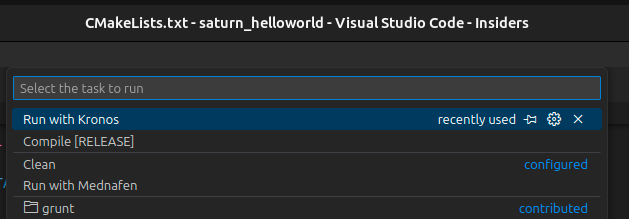
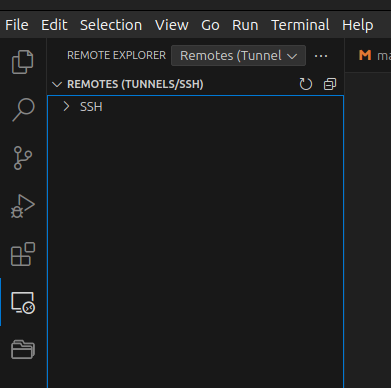
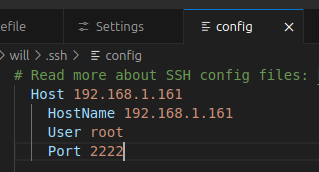
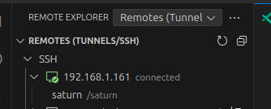
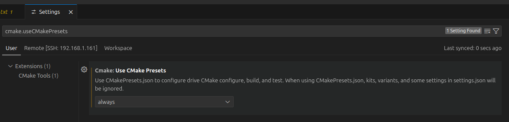

# Using alongside with Visual Studio

## Configuration

### List of Required Extensions

+ C/C++ by Microsoft
+ C/C++ Extension Pack by Microsoft
+ C/C++ Themes by Microsoft
+ Remote - SSH by Microsoft (optional)
+ CMake Tools by Microsoft (optional)
+ ...

### Container Configuration - The Easiest Way

Pre-build images are available from docker.hub (https://hub.docker.com/r/willll/saturn-docker/tags

+ `docker pull willll/saturn-docker:gcc_13.3.0`
+ `docker run -it -p 2222:22 --rm -v $(pwd):/saturn saturn-docker:gcc_13.3 /bin/bash`
+ Note: `$(pwd)` represents the local folder shared between the Docker container and your host computer.

### Container Configuration - An Easy Way

You can use [Portainer.io](https://www.portainer.io/) to pull content from GitHub: [Portainer Documentation](https://docs.portainer.io/user/docker/stacks/add).

+ Repository URL: `https://github.com/willll/saturn-docker/`
+ Repository Reference: `refs/heads/main`
+ Compose Path: `compose.yaml`
+ Use `portainer.env`: [portainer.env](https://github.com/willll/saturn-docker/blob/main/portainer.env)

Once done, save, pull & redepoy. A new container shall be added and running once the image is built.

### Container Configuration, the hard way

Build you own image from github :

+ clone the Repository : git clone https://github.com/willll/saturn-docker.git
+ build the image : cd saturn-docker && docker build --build-arg GCC_VERSION_ARG=14.1.0 -t saturn-docker . --file ./Dockerfile
+ run it : docker run -it -p 2222:22 --rm -v /tmp/shared:/saturn saturn-docker /bin/bash
+ Note : /tmp/shared being the local folder shared between the docker and your host computer.
+ Note2 : 2222 will be the SSH port to reach out the container.
+ Share your SSH certificate with the container (TODO : make it permanent) : ssh-copy-id -p 2222 root@127.0.0.1

### Share your code between docker and Visual Studio

That does not apply if you are running docker on your computer, but for people using remote servers.

+ Share using sshfs (https://code.visualstudio.com/docs/remote/troubleshooting#_using-sshfs-to-access-files-on-your-remote-host) : sudo sshfs -o allow_other root@192.168.1.161:/saturn /tmp/saturn/ -p 2222
+ Note : This command will map the directory /saturn hosted on the SSH server 192.168.1.161, using the port 2222, to the local folder /tmp/saturn/
+ Note2 : Default SSH credentials for SSH are root/root

### Visual Studio Code Configuration

Lets try to build https://github.com/willll/saturn_helloworld

+ Clone the repository, either from VSCode (https://code.visualstudio.com/docs/sourcecontrol/intro-to-git) or CLI, make sure to clone it into the folder shared with the docker images
+ Tasks are already configured into .vscode/tasks.json :

```JSON
    {
        "label": "Compile [RELEASE]",
        "type": "shell",
        "command": "ssh root@127.0.0.1 -p 2222 \"\
                    mkdir -p /saturn/build && \
                    cd /saturn/build && rm -rf * && \
                    cmake -DCMAKE_TOOLCHAIN_FILE=\\$SATURN_CMAKE/sega_saturn.cmake \
                            -DCMAKE_INSTALL_PREFIX=/saturn/ .. && \
                    make all && \
                    make install && \
                    chmod 777 -R /saturn/{build,helloworld}/\"",
    },
    {
        "label": "Clean",
        "type": "shell",
        "command": "ssh root@127.0.0.1 -p 2222 \"rm -rf /saturn/build/* && rm -rf /saturn/helloworld/*\"",
    },
    {
        "label": "Run with Kronos",
        "type": "shell",
        "command": "kronos -a ${workspaceFolder}/helloworld/helloworld.cue",
    },
    {
        "label": "Run with Mednafen",
        "type": "shell",
        "command": "mednafen ${workspaceFolder}/helloworld/helloworld.cue",
    }
```



Those are configured to use a local SSH server on 127.0.0.1:2222, but for a local docker is it way easier to use :
```JSON
    {
        "label": "Compile Docker [RELEASE]",
        "type": "shell",
        "command": "docker run -it -p 2222:22 --rm -v $(pwd):/saturn saturn-docker:latest /bin/sh -c \"\
                    mkdir -p /saturn/build && \
                    cd /saturn/build && rm -rf * && \
                    cmake -DCMAKE_TOOLCHAIN_FILE=\\$SATURN_CMAKE/sega_saturn.cmake \
                            -DCMAKE_INSTALL_PREFIX=/saturn/ .. && \
                    make all && \
                    make install && \
                    chmod 777 -R /saturn/build/ && \
                    chmod 777 -R /saturn/helloworld/ \"",
    },
    {
        "label": "Clean Docker",
        "type": "shell",
        "command": "docker run -it -p 2222:22 --rm -v $(pwd):/saturn saturn-docker:latest /bin/sh -c \
                    \"rm -rf /saturn/build/* && rm -rf /saturn/helloworld/*\"",
    }
```

+ If you are using SSH, you need to configure it (https://code.visualstudio.com/docs/remote/ssh) before going any further :
  - Note : Remote connection will prevent to run tasks on the local computer (https://stackoverflow.com/questions/69171275/vscode-using-remote-ssh-run-tasks-on-host-machine), hence it will not be a 100% integrated solution.
  - Install the Remote-SSH extension (https://marketplace.visualstudio.com/items?itemName=ms-vscode-remote.remote-ssh)
  - Install Remote Explorer extention (https://marketplace.visualstudio.com/items?itemName=ms-vscode.remote-explorer)
  - In Remote Explorer add a SSH connection :

  

  - Enter the connection string you would normally used to connect to your server, for example : ssh root@192.168.1.161 -p 2222
  - It should update your configuration file such as :

  

  - You will be prompted for the SSH user account password (eventually),
  - Once connected it should look like this :

  

+ Since the project is using CMake, lets install CMake Tools :
  - https://github.com/microsoft/vscode-cmake-tools/blob/HEAD/docs/cmake-presets.md
  - Enable presets :



 - CMake tools configuration : https://code.visualstudio.com/docs/cpp/CMake-linux
 - CMake Tools documentation : https://github.com/microsoft/vscode-cmake-tools/tree/main/docs#cmake-tools-for-visual-studio-code-documentation
